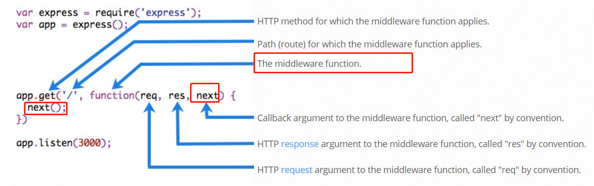
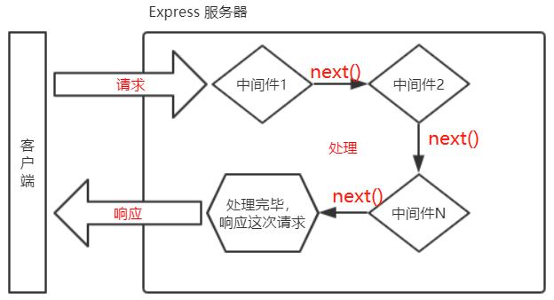
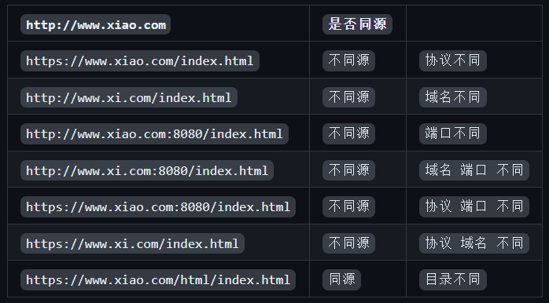
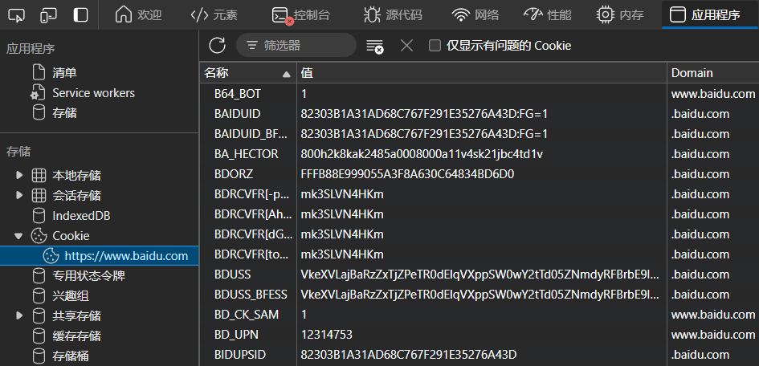
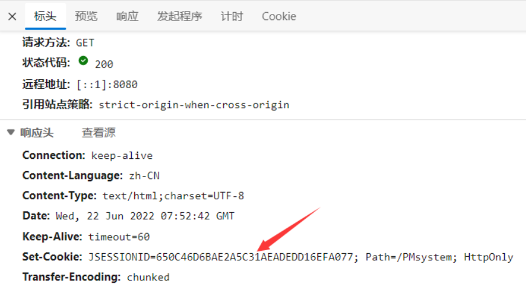
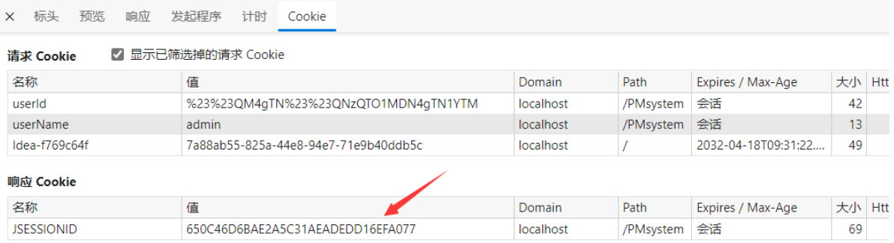
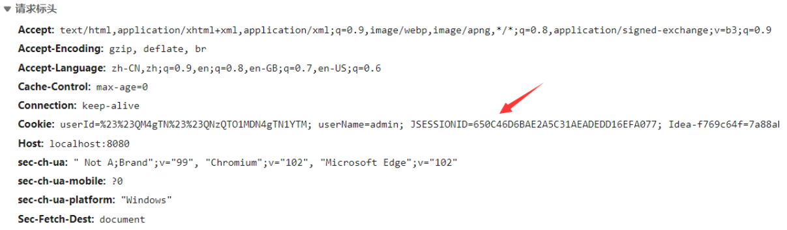

`模块化定义`
--

`模块化就是把一个大文件拆成独立并互相依赖的多个小模块 于整个系统来说模块是可组合分解和更换的单元` `模块化规范就是对代码进行模块化的拆分与组合时需要遵守的那些规则`


`代码模块化拆分好处`
--

`1、提高了代码的复用性`

`2、提高了代码的可维护性`

`3、可以实现按需加载`

`Node 中模块分类`
--

`! 内置模块由 NodeJs 官方提供 如 fs、path、http 等`

`!! querystring` `处理查询字符串 通过这个模块提供的 parse 函数 可以把查询字符串解析成对象的格式`

`! 自定义模块 用户创建的每个js文件都是自定义模块`

`! 第三方模块 由第三方开发出来的模块 需要下载`

`加载模块`
--

`require` `可以加载需要的内置模块 用户自定义模块 第三方模块使用 加载模块时 会执行被加载模块中的代码`

`模块作用域`
--

`! 定义 自定义模块中定义的变量 方法等成员只能在当前模块内被访问 这种模块级别的访问限制叫做模块作用域`

`! 好处 防止了全局变量污染的问题`

`共享成员`
--

`1、module`

`每个 js 自定义模块中都有一个 module 对象 它里面存储了和当前模块有关的信息` `console.log(moudle)`

`2、module.exports` `...不起名字导不出去?`

`在自定义模块中可以使用 module.exports 对象将模块内的成员共享出去供外界使用 外界用 require 方法导入自定义模块时得到的就是 module.exports 所指向的对象`

`3、exports`

`默认情况 exports 和 module.exports 指向同一个对象`

`4、共享的结果以 module.exports 指向的对象为准`

`NodeJs 模块化规范`
--

`NodeJs 遵循了 CommonJS 模块化规范` `CommonJS 规定了模块的特性和各模块之间如何相互依赖`

`> CommonJS`

`1、每个模块内部 module 变量代表当前模块`

`2、module 变量是一个对象 它的 exports 属性即 module.exports 是对外的接口`

`3、加载某个模块其实是加载该模块的 module.exports 属性`

`格式化时间` `YYYY-MM-DD HH-mm-ss`
--

`> 传统方法`

```js
class DateFormat {
    
    static PAD_ZERO = function(n) {
        return n > 9 ? n : '0' + n
    }

    static dateFormat(dateStr) {
        const date = new Date(dateStr)
        const YYYY = date.getFullYear()
        const MM = this.PAD_ZERO(date.getMonth() + 1)
        const DD = this.PAD_ZERO(date.getDate())
        const HH = this.PAD_ZERO(date.getHours())
        const mm = this.PAD_ZERO(date.getMinutes())
        const ss = this.PAD_ZERO(date.getSeconds())
        return `${YYYY}-${MM}-${DD} ${HH}-${mm}-${ss}`

    }
}
```

`> moment`

```js
const moment = require('moment')
const date = moment().format('YYYY-MM-DD hh:mm:ss')
console.log(date)
```

`NPM 与 包`
--

`由于 NodeJs 的内置模块仅提供了一些底层的 API 导致在基于内置模块进行项目开发的时效率很低 包是基于内置模块封装出来的 提供了更高级更方便的 API 极大的提高了开发效率`

`> 定义`

`! NPM` `包管理工具` `NPM -V`

`! 包` `第三方模块`

`> NPM 命令`

`! 安装核心依赖包` `npm i/install ...` `全局` `-g`

`! 安装指定版本号包` `npm i/install ...@...`

`版本号: 大版本.功能版本.Bug修复版本` `版本号提升的规则: 只要前面的版本号增长了 则后面的版本号归零`

`! 快速创建包管理配置文件 package.json 安包之前 只需一次` `npm init -Y` 

`只能在英文的目录下成功运行 不能出现空格` `运行 npm install 命令安装包的时候 npm 包管理工具会自动把包的名称和版本号记录到 package.json 中`

`! 一次性安装多个包` `npm i/install ... ...`

`! 一次性安装全部包` `npm i/install`

`! 卸载包` `npm uninstall ...` `全局` `-g`

`! 开发依赖包` `npm i/install ... -D` `npm i/install ... --save-dev` `webpack 可以和 -D/--save-dev 调换`

`! 镜像服务器` `查看当前镜像源` `npm config get registry` `切换镜像源` `npm config set registry="URL"` 

`由于网站服务器是国外的 网络数据传输要经过漫长的海底光缆`

`! nrm` `npm i/install nrm -g` `查看可用镜像源` `nrm ls` `切换镜像源` `nrm use ...`

`! i5ting_toc` `作用: md 转 html` `mpm i/install i5ting_toc -g` `转换并通过默认浏览器打开` `i5ting_toc -f md 文件路径 -o`

`为了更方便的切换下包的镜像源 我们可以安装 nrm 这个小工具 利用 nrm 提供的终端命令 可以快速查看和切换下包的镜像源`

`! nodemon` `作用: 够监听项目文件的变动 当代码被修改后 nodemon 会自动帮我们重启项目 极大方便了开发和调试` `npm i/install nodeman -g` `启动` `nodeman app.js`

`> 包分类`

`! 项目包`

`1、开发依赖包`

`2、核心依赖包`

`! 全局包` `-g` `安装目录：C:\Users\XiaoYu\AppData\Roaming\npm\node_modules\nrm`

`初次装包后项目文件夹多的文件`
--

`! node_modules 的文件夹`

`node_modules 文件夹用来存放所有已安装到项目中的包 require 导入第三方包时就是从这个目录中查找并加载包`

`! package-lockjson 的配置文件`

`package-lock.json 配置文件用来记录 node_modules 目录下的每一个包的下载信息 例如包的名字、版本号、下载地址`

`包管理配置文件` `package.json`
--

`NPM 规定在项目根目录中必须提供 package.json 的包管理配置文件记录与项目配置信息`

`1、项目的名称 版本号 描述`

`2、开发期间会用到的包 开发依赖包` `devDependencies`

`3、开发和部署时都需要用到的包 核心依赖包` `dependencies`

`多人协作`
--

`在项目开发中把 node_modules 文件夹 添加到.gitignore 忽略文件中 在团队成员之间共享项目的源代码即可`

`规范包结构`
--

`1、包必须以单独的目录而存在`

`2、包的顶级目录下要必须包含 package.json 这个包管理配置文件`

`3、package.json 中必须包含 name version main 这三个属性分别代表包的名字 版本号 包的入口`

`开发包步骤`
--

`1、新建文件夹作为包的根目录`

`2、在文件夹中新建三个文件`

`2.1 package.json` `包管理配置文件`

```json
{
    "name": "名称",
    "version": "版本号",
    "main": "入口文件",

    "description": "简短描述",
    "keywords": ["搜索关键字","..."],
    "license": "ICS 开源许可协议"
}
```

`2.2 index.js` `包的入口文件`

`2.3 README.md` `包的说明文档` `安装方式、导入方式、方法、开源协议`

`3、Npm 发布`

`3.1. npm login 登录`

`3.2 npm publish 根目录 发布`

`3.3 npm unpublish ... --force 删除72小时以内`

`模块加载机制`
--

`> 模块加载机制` `优先从缓存中加载` `模块第一次加载会被缓存 加载时候只执行一次`

`> 内置模块加载机制` `内置加载模块优先级最高`

`> 自定义模块加载机制`

`! 必须以 ./ 或 ../ 开头的路径标识符 否则当作内置模块或第三方模块`

`! 自定义模块省略了文件扩展名加载顺序` `require`

`1、确切文件名加载`

`2、补全 .js 扩展名加载`

`3、补全 .json 扩展名加载`

`4、补全 .node 扩展名加载`

`5、加载失败终端报错`

`> 第三方模块加载机制` `在当前文件的父级目录开始 尝试从 node_moudles 文件夹中加载第三方模块 如果没有找到则在上一层父目录进行加载直到文件系统的根目录`

`Express`
--

`> Express 简介` `定义 创建 Web 服务器的 Web 开发框架 本质 NPM 第三方模块`

`> 前端两种服务器` `使用 Express 可以方便 快速的创建 Web 网站的服务器 或 API 接口服务器`

`! Web 网站服务器 专门对外提供 Web 网页资源的服务器`

`! API 接口服务器 专门对外提供API接口的服务器`

`> 安装` `npm i express 4.17.1`

`> 创建 Web 服务器`

```js

const express =require('express')

const app = express()

...

app.listen(80,()=>{
    console.log('express server running at http://127.0.0.1')
})
```

`> 监听 GET POST 请求 响应请求给客户端 启动服务器之前`

```JS
app.get('URL'，(req，res)=>{
    res.send()
})
app.post('URL'，(req，res)=>{
    res.send()
})
```

`> 获取 URL 的查询参数`

`! 获取查询字符串的形式参数`

`?name=xiao&age=20` `通过 req.query 对象 可以访问到客户端通过查询字符串的形式发送到服务器的参数` `req.query` `req.query.name` `req.query.age`

`! 获取 URL 的动态参数` 

`:id/:username` `通过 req.params 对象 可以访问到 URL 中通过 : 匹配到的动态参数`

`> express.static 快速托管静态资源 启动服务器之前`

`将 public 目录下的` `图片` `CSS 文件` `JavaScript 文件` `对外开放访问了` `Express 存放静态文件的目录名不会出现在 URL 中`

`托管多个静态资源目录` `多次调用 express.static` `访问静态资源文件时 express.static 函数会根据目录的添加顺序查找所需的文件 找到了就无需再找`

```js
app.use(express.static('./public'))
```

`> 路由` 

`app.GET app.POST ...` `客户端请求与服务器处理函数之间的映射关系`

`! 组成: 请求的类型 请求的 UR 地址 处理函数`

`! 路由的匹配过程`

`每当一个请求到达服务器之后 需要先经过路由的匹配 在匹配时会按照路由定义的顺序进行匹配 必须 请求类型 和 请求的 URL 同时满足才能匹配成功` `找到就无需再找` `成功后 Express 会将这次请求转交给对应的 Function 函数处理`

`! 模块化路由`

`为了方便对路由进行模块化的管理 Express 不建议将路由直接挂载到 app 上 而是推荐将路由抽离为单独的模块`

```js
const express = require('express')
const router = express.Router()
...
module.exports = router
```
```js
const userRouter = require('./router/userRouter.js')
app.use(userRouter)
```

`> 路由抽离为单独模块的步骤`

`1、创建路由模块对应的 js 文件`

`2、调用 express.Router 函数创建路由对象`

`3、向路由对象上挂载具体的路由`

`4、使用 module.exports 向外共享路由对象`

`5、使用 app.use 函数注册路由模块`

`Express 中间件` `本质 Function 处理函数` `业务流程中间处理环节`
--

`污水 → 一级处理 → 二级处理 → 三级处理 → 达到标准的废水`

`多个中间件之间 路由 共享同一份 req res 可以为其挂载属性方法`

`> Express 中间件格式`

`中间件函数的形参列表中必须包含 next 参数 而路由处理函数中只包含 req res`

`next 函数是实现多个中间件连续调用的关键 它表示把流转关系转交给下一个中间件或路由`



`> Express 中间件的调用流程`

`可以连续定义多个中间件 请求到达 Express 服务器之后 会按照中间件定义的先后顺序依次进行调用 从而对这次请求进行预处理`



`> 定义中间件函数`

```js
const m = function (req,res,next) {
    ...
    next()
}
```

`> 全局生效的中间件`

`客户端发起的任何请求到达服务器之后 都会触发的中间件叫做全局生效的中间件通过调用`

```js
app.use(m)
```

```js
app.use((req,res,next) => {
    ...
    next()
})
```

`> 局部生效的中间件`

```js
app.get('', m1 , m2 , (req,res) => {
    ...
})
```

```js
app.get('' , [m1,m2] , (req,res) => {
    ...
})
```

`> 中间件分类`

`! 应用级别中间件 路由之前注册`

`! 路由级别中间件 路由之前注册`

`! 错误级别中间件 全局 所有路由之后注册`

`作用 专门用来捕获整个项目中发生的异常错误从而防止项目异常崩溃的问题错误级别中间件的 Function 处理函数中必须有4个形参分别是 err req res next`

`> 中间件分类`

`! 内置中间件`

`! 第三方的中间件`

`> Express 内置中间件`

`! express.static` `托管静态资源的内置中间件`

`! express.json` `解析 JSON 格式的请求体数据的内置中间件` `4.16.0+`

`! express.urlencoded` `解析 application/x-www-form-urlencoded 格式请求体数据的内置中间件` `4.16.0+`

```js
app.use(express.json())
app.use(express.urlencoded({ extended: false }))
```

`> 挂载路径前缀`

`自定义中间件` `模拟表单数据解析中间件`

`1、定义中间件`

`2、监听 req 的 data 事件`

`在中间件中需要监听 req 对象的 data 事件来获取客户端发送到服务器的数据如果数据量比较大 无法一次性发送完毕则客户端会把数据切割后分批发送到服务器所以 data 事件可能会触发多次 每一次触发 data 事件时获取到数据只是完整数据的一部分 需要手动对接收到的数据进行拼接`

`3、监听 req 的 end 事件`

`当请求体数据接收完毕之后会自动触发 req 的 end 事件 因此我们可以在 req 的 end 事件中拿到并处理完整的请求体数据`

`4、使用 querystring 模块解析请求体数据`

`5、将解析出来的数据对象挂载为 req.body`

`上游的中间件和下游的中间件及路由之间共享同一份 req 和res 因此我们可以将解析出来的数据挂载为 req 的自定义属性命名为req.body 供下游使用`

`6、将自定义中间低封装为模块`

```js
const express = require('express')

const app = express()

const qs = require('querystring')

app.use((req,res,next) => {
    
    let str = ''

    req.on('data',(chunk) => {
        str += chunk
    })

    req.on('end',() => {
        
        const b = qs.parse(str)

        req.body = b

    })

    next()
})

app.post('',(req,res) => {
    res.send()
})

app.listen(80,()=>{
    console.log('express server running at http://127.0.0.1')
})
```

`> express` `创建 API 接口`

`CORS` `跨域资源共享` `协议 域名 端口号 任何一个不同都存在跨域问题`
--



`CORS 由一系列 HTTP 响应头组成 这些 HTTP 响应头决定浏览器是否阻止前端 JS 代码跨域获取资源`

`浏览器的同源安全策略默认会阻止网页"跨域"获取资源 但如果接口服务器配置了 CORS 相关的 HTTP 响应头就可以解除浏览器端的跨域访问限制`

`CORS 主要在服务器端进行配置 客户端浏览器无须做任何额外的配置 即可请求开启了CORS的接口`

`CORS 在浏览器中有兼容性 只有支持 XMLHttpRequestLevel2 的浏览器 正常访问开启了 CORS 的服务端接口 例如：IE10+ Chrome4+ FireFox3.5+`

`> cors` `Express 的一个第三方中间件`

`! 安装中间件` `npm install cors`

`! 导入中间件` `const cors = require(cors)`

`! 配置中间件` `app.use(cors())`
    
`> CORS 响应头部 Access-Control-Allow-Origin` ` <origin> | *`

`! Origin 参数指定了允许访问该资源的外域 URL`

`res.setHeader('Access-Control-Allow-Origin','http://xxx.cn')` `只允许来自 http://xxx.cn 的请求`

`> 简单请求和预检请求的区别`

`简单请求的特点：客户端与服务器之间只会发生一次请求`

`预检请求的特点：客户端与服务器之间会发生两次请求 OPTION 预检请求成功之后才会发起真正的请求`

`mYSQL`
--

`! 定义 连接和操作 mYSQL 数据库` `本质 NPM 第三方模块`

`! 安装  npm install mysq1`

`! 配置 mYSQL`

```js
const mysql =require('mysql')
const db = mysql.createPool({
    host: '127.0.0.1',
    user: 'root',
    password: 'admin123',
    database: 'db_01'
})
```

`> 测试能否正常工作` `'SELECT 1'` 

```js
db.query('SELECT 1',(err,results) =>{
    if (err) return console.log(err.message)
    console.log(results)
})
```

`> select` `查询语句则执行的结果 results 是数组`

```JS
const sqlStr = 'select * from users'
db.query(sqlStr，(err,results)=>{
    if (err) return console.log(err.message)
    console.log(results)
})
```

`> insert` `插入语句则执行的结果 results 是对象`

```JS
const user = { username:'xxx',password:'000000'}

const sqlStr = 'INSERT INTO users (username,password) VALUES (?,?)'

db.query(sqlStr,[ user.username , user.password ],(err, results) => {
    if(err)return console.log(err.message)
    if(results.affectedRows === 1){console.log('YES')}
})
```

```JS
const user = { username:'xxx',password:'000000'}

const sqlStr='INSERT INTO users SET ?'

db.query(sqlStr,user,(err, results) => {
    if(err)return console.log(err.message)
    if(results.affectedRows === 1){console.log('YES')}
})
```

`> update`

```JS
const user = { id:6,username:'xxx' , password:'0000000' }

const sqlStr = 'update users set username=?,password=? where id=?'

db.query(sqlstr,[user.username,user.password, user.id],(err, results) =>{
    if(err)return console.log(err.message)
    if(results.affectedRows === 1){console.log('YES')}
})
```

```JS
const user ={ id:6,username:'xxx',password:'000000'}

const sqlStr ='update users set ? where id=?'

db.query(sqlstr, [user, user.id], (err, results) => {
    if(err)return console.log(err.message)
    if(results.affectedRows === 1){console.log('YES')}
})
```

`> delete`

```js
const sqlStr ='delete from users where id=?'
db.query(sqlstr，5，(err,results)=>{
    if(err)return console.log(err.message)
    if(results.affectedRows === 1){console.log('YES')}
})
```

`> 标记删除`

`DELETE 语句 会把真正的把数据从表中删除掉为了保险起见推荐使用标记删除的形式来模拟删除的动作即在表中设置类似于 status 这样的状态字段来标记当前这条数据是否被删除 当用户执行了删除的动作时我们并没有执行 DELETE 语句把数据删除掉而是执行了 UPDATE 语句将这条数据对应的 status 字段标记为删除即可`

`身份认证`
--

`Web 开发中涉及到用户身份的认证 例如: 各大网站的手机验证码登录 邮箱密码登录 二维码登录`

`> HTTP 协议的无状态性`

`HTTP 协议的无状态性 指的是客户端的每次 HTTP 请求都是独立的 连续多个请求之间没有直接的关系服务器不会主动保留每次HTTP请求的状态`

`> 定义:` 

`身份认证 Authentication 又称 "身份验证" "鉴权" 是指通过一定的手段完成对用户身份的确认`

`> 身份认证的目的:`

`确认当前某种身份的用户确实是这个身份`

`> 不同开发模式下的身份认证`

`! 服务端染` `Session 认证机制`

`! 前后端分离` `JWT 认证机制`

`session`
--

`> Cookit` `会员卡身份认证方式 在 Web 开发中的专业术语叫做 Cookie`

`Cookie 是存储在用户浏览器中的一段不超过 4KB 的字符串` `由` `Name` `Value` `控制 Cookie 的可选属性: ` `有效期` `安全性` `使用范围` `组成`



`浏览器第一次请求服务器` `服务器通过响应头的形式向客户端发送一个用于身份认证的 Cookie` `客户端会自动将 Cookie 保存在浏览器中`

`不同域名下的 Cookie 各自独立 每当客户端发起请求时会自动把当前域名下所有未过期的 Cookie 通过请求头的形式发送给服务器 服务器由此可验明客户端的身份`

`> Cookie的几大特性`

`1、自动发送`

`2、域名独立`

`3、过期时限`

`4、4KB 限制`

`> 不安全`

`由于 Cookie 是存储在浏览器中的而且浏览器也提供了读写 Cookie 的 API 因此 Cookie 很容易被伪造不具有安全性 因此不建议服务器将重要的隐私数据通过 Cookie 的形式发送给浏览器存储 比如用户的身份信息 密码 等`

`> session` `工作原理`

`提高身份认证的安全性` `"会员卡+刷卡认证"的设计理念就是 Session 认证机制的精髓`

`1、首次访问服务器` `在响应头里看见 Set-Cookie 的信息`



`2、响应` `访问服务器的时候 服务器会为每一个用户设置一个 session`



`3、再次请求` `浏览器会在请求头里将 cookie 发送给服务器` `JSESSIONID 是浏览器用来识别当前用户对应的 session`



`4、过期` `请求头和响应头都有 JSESSIONID 这是因为游览器携带的 JSESSIONID 在服务器端并没有对应的 session 即 session 过期了 所以服务器创建了一个新的 session 把新的 JSESSIONID 返回给游览器`

`> session 局限性`

`cookie 默认不支持跨域访问 当涉及到前端跨域请求后端接口的时候 需要做很多额外的配置才能实现跨域 Session 认证`

`express-session`
--

`! 安装 express-session 中间件` `npm i/install express-session`

`! 配置 express-session 中间件`

```js
const session = require('express-session')

app.use(session({
    secret: '',
    resave: false,
    saveUninitialized: true
}))
```

`> 向 session 中存数据` 

`当 express-session 中间件配置成功后即可通过 req.session 来访问和使用 session 对象 从而存储用户的关键信息`

```js
app.post('',(req,res)=>{

    if (req.body.username !== 'admin' || req.body.password !== '000000'){
        return res.send({ status:1，message:'NO'})
    }

    req.session.userinfo = req.body
    req.session.islogin = true

    res.send({status:0，message:'YES'})

})
```

`> 在 session 中取数据`

```js
app.get('',(req,res)=>{

    if (!req.session.islogin){
        return res.send({ status:1,message:'NO'})
    }

    res.send({ status:0,msg:'success',username:req.session.userinfo.username })

})
```

`> 清空 session` `退出登录`

```js
app.post('',(req, res) => {

    req.session.destroy()

    res.send({
        status:0,
        message:'loginOut'
    })

})
```


`JWT` `跨域认证解决方案`
--

`客户端每次在访问那些有权限接口的时候都需要主动通过请求头中的 Authorization 字段将 Token 字符串发送到服务器进行身份认证`

`好的认证模式是在它过期之前刷新令牌将令牌过期时间设置为一周 并在每次用户打开 Web 应用程序每隔一小时刷新令牌 如果用户超过一周没有打开过应用程序那他们就需要再次登录 这是可接受的 Web 应用程序 UX 即用户体验 要刷新令牌 API 需要一个新的端点它接收一个有效的没有过期的 JWT 并返回与新的到期字段相同的签名的 JWT 然后 Web 应用程序会将令牌存储在某处`

`> JWT 工作原理`

`客户端登录提交账号与密码 验证账号和密码 用户成功登录系统时授权服务器把登录信息经过加密之后以 JSON Web Token 返回给客户端 用户将此凭证信息存储在本地 cookie 或 浏览器缓存 当用户发起新的请求时在请求头中附带此凭证信息 当服务器接收到用户请求时 将 Token 解密还原成用户的信息对象 检查请求头中有无凭证是否过期是否有效 凭证有效将放行请求 凭证非法或者过期服务器将回跳到认证中心重新对用户身份进行验证直至用户身份验证成功`

`> JWT 组成部分` `Header.Payload.Signature 头部.有效荷载.签名`

```
eyJhbGci0iJIUzI1NiIsInR5cCI6IkpXVCJ9.eyJpZCI6MSwidXNlcm5hbwUi0iJhZG1pbiIsInBhc3N3b3JkIjoiIiwibmlja25
hbwUi0iLms6Xlt7T1t7QiLCJ1bWFpbCI6Im5pYmFiYUBpdGNhc3QuY24iLCJ1c2VyX3BpYyI6IiIsImlhdCI6MTU30DAzNjY4Miw
iZXhwIjoxNTc4MDcyNjgyfQ.Mwq7GqCxJPK-EA8LNrtMG0411KdZ33S9KBL3XeuBxuI
```

`1、有效荷载 真正的用户信息它是用户信息经过加密之后生成的字符串`

`2、头部 签名 安全性相关的部分保证 Token 的安全性`

`> 使用方式`

`把 JWT 放在 HTTP 请求头的 Authorization 字段` `Authorization:Bearer <token>`

`express jwt`
--

`> 安装` `npm i/install jsonwebtoken express-jwt`

`! jsonwebtoken 生成 JWT 字符串`

`! express-jwt 将 JWT 字符串解析还原成 Json 对象`

`> 导入`

```js
const jwt =require('jsonwebtoken')

const expressJwT =require('express-jwt')
```

`> 定义密钥`

`为了保证 JWT 字符串的安全性 防止 JWT 字符串在网络传输过程中被别人破解 我们需要专门定义一个用于加密和解密的密钥`

`当生成 JWT 字符串的时候需要使用密钥对用户的信息进行加密最终得到加密好的 JWT 字符串`

`当把 JWT 字符串解析还原成 JSON 对象的时候需要使用密钥进行解密`

`const secretKEY = ''`

`登录成功后生成 JWT 字符串`

```js
app.post('',function(req,res){

    res.send({
    status: 200,
    message:'Yes',

    token:jwt.sign({username:userinfo.username },secretKEY,{expiresIn:'30s'})
    })

})
```

`> JWT 字符串还原为 JSON 对象`

```js
app.use(expressJWT({ secret: secretKEY }).unless({ path: ''}))
```

`! unless` `不需要访问权限的接口`

`> Req`

`req.user` `获取用户信息`

```js
app.get('',function(req,res){

    console.log(req.user)

    res.send({
    status: 200,
    message:'Yes',
    data: req.user

    })
})
```

`> 获解析 JWT 失败后产生的错误`

`对于客户端发送过来过期或不合法的 Token 字符串 会产生一个解析失败的错误影响项目的正常运行 可以通过 Express 的错误中间件捕获这个错误并进行相关的处理`

```js
app.use((err, req, res, next) =>{

    if(err.name === 'UnauthorizedError') {
        return res.send({status:401,message: 'invalid token'})
    }

    res.send({status:500,message: 'unknown error'})

})
```
