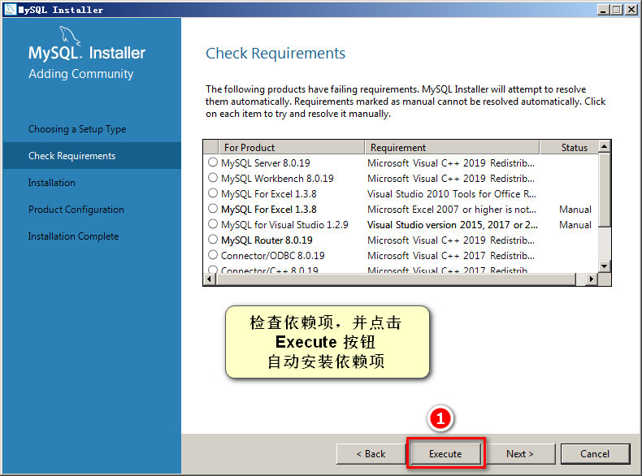
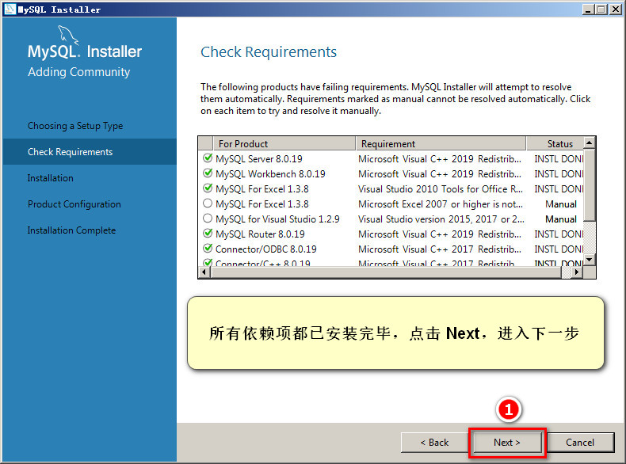
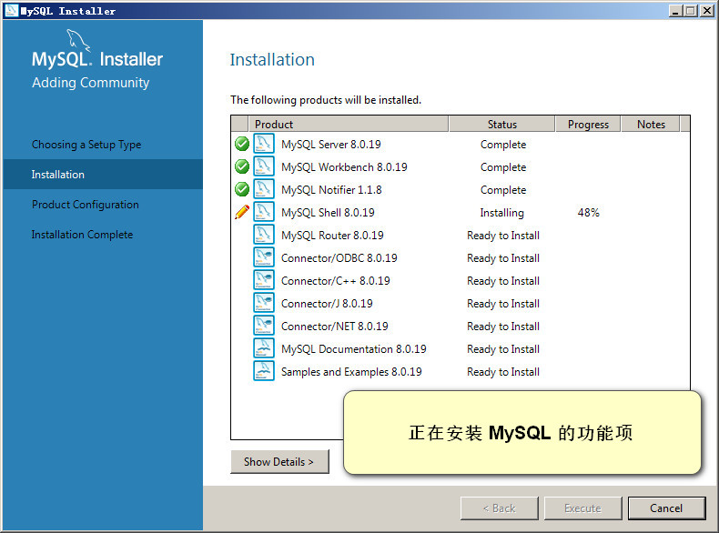
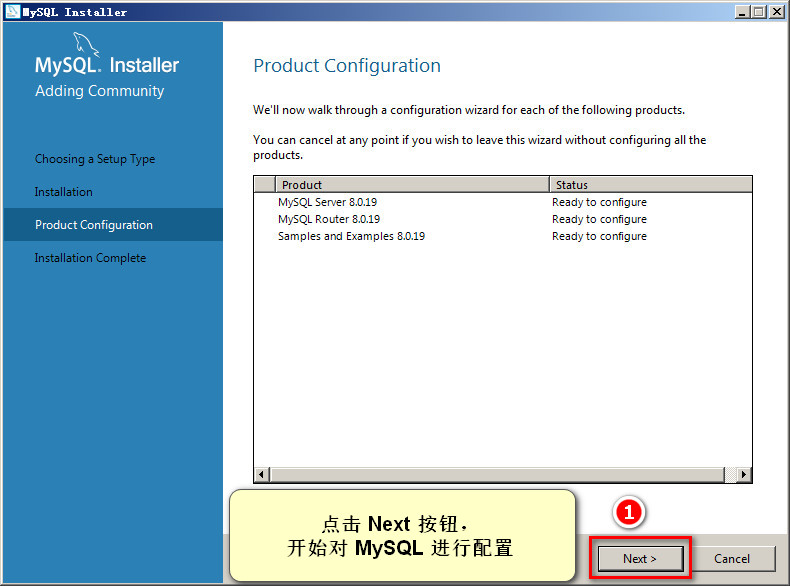
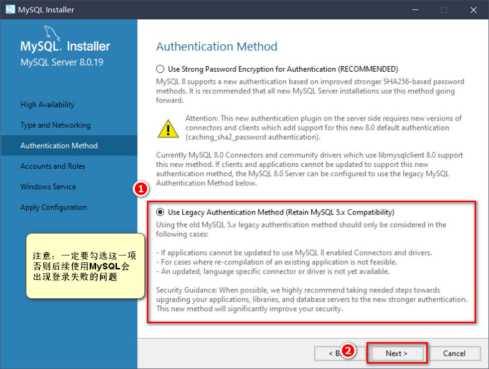
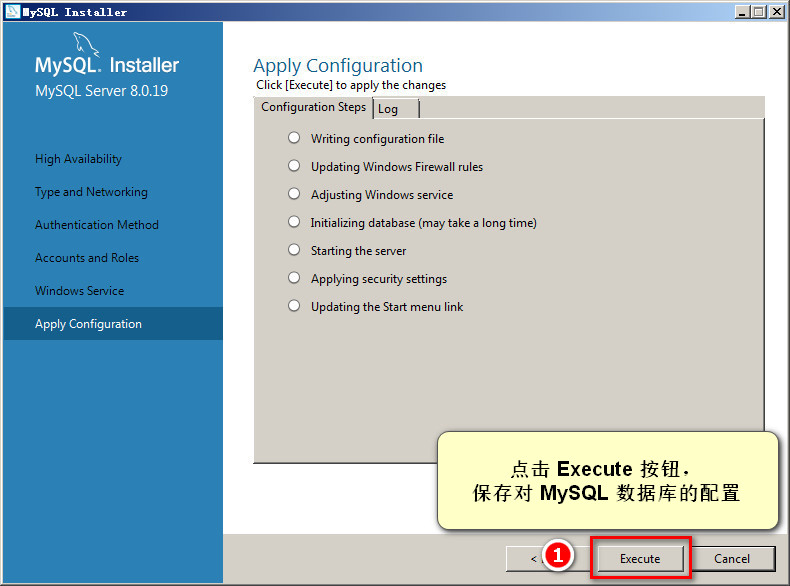
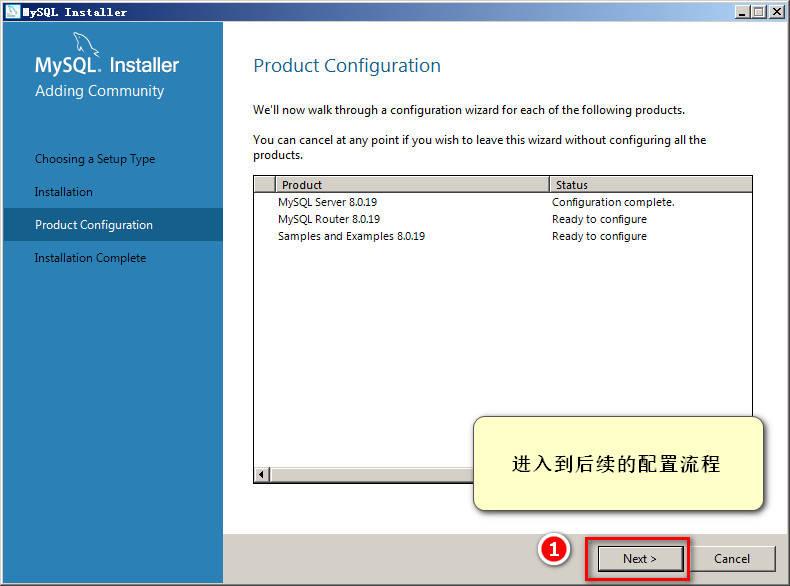
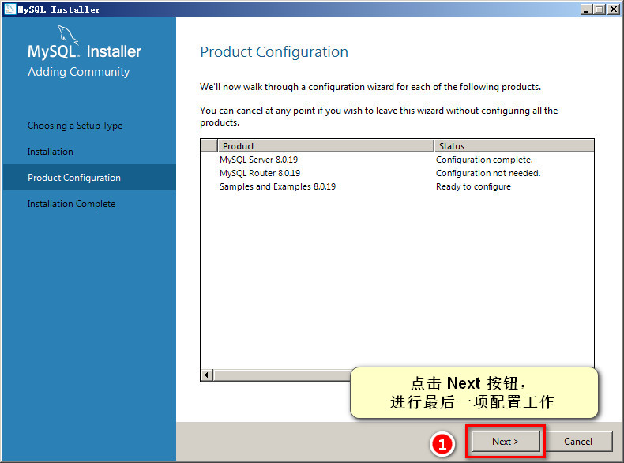
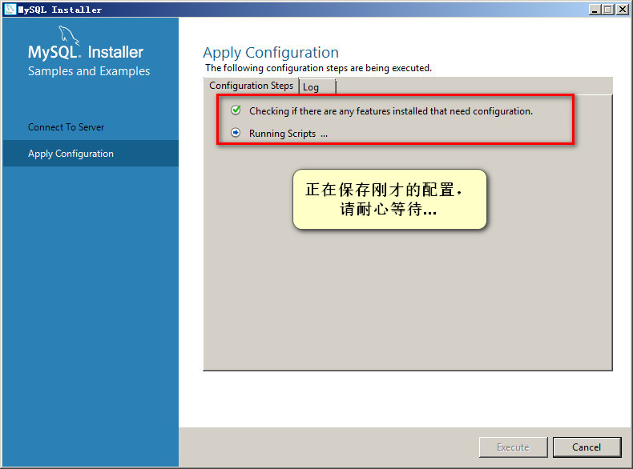
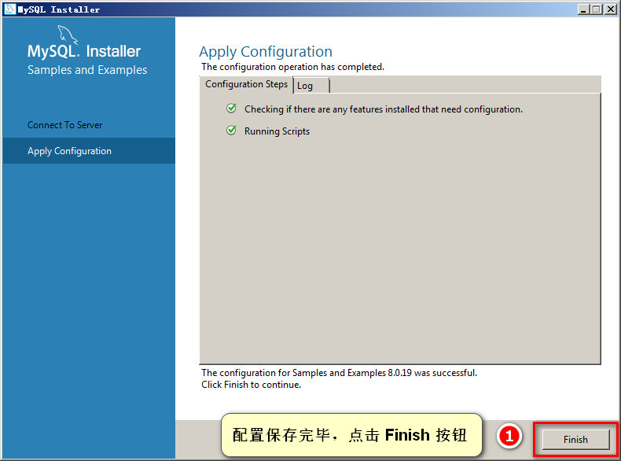

`Windows 系统下的安装`
--

`双击 mYsql-installer-community-8.0.19.0.msi 启动 mYSQL 安装程序`

`如果弹框提示如下的警告信息 证明你的电脑需要安装额外的 .NET Framework 依赖包 此时 先退出 mYSQL 的安装程序 然后双击 NDP452-KB2901907-x86-x64-AllOS-ENU.exe 启动 .NET Framework 4.5.2 的安装程序`

`重新启动 mYSQL 的安装程序 看到如下界面`

`进入如下界面`

`正在安装依赖项`

`完成依赖项的安装`

`此时 会弹出如下警告窗 直接点击 Yes 即可`

`进入 mYSQL 的安装页面`

`完成 mYSQL 功能项的安装`

`配置 mYSQL`

`选择 mYSQL 数据库的运行模式`

`设置网络模式`

`配置身份认证方式`

`设置 mYSQL 的默认 root 用户密码`

`将 mYSQL 配置为 Windows 的服务`

`保存刚才对 mYSQL 配置的修改`

`继续完成后续的配置流程`

`最后一个配置项`

`测试能否正常连接到刚才安装的 mYSQL 数据库`

`保存刚才的配置`

`完成 mYSQL 的安装与配置`

